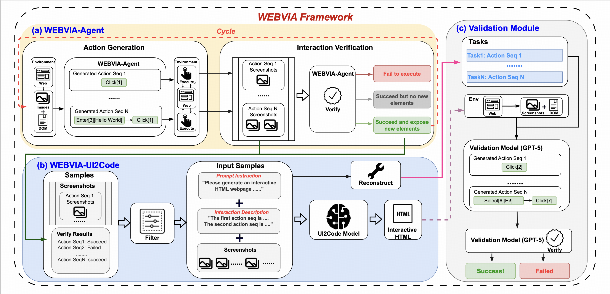

# WebVIA: A Web-based Vision-Language Agentic Framework for Interactive and Verifiable UI-to-Code Generation

</div>



<p align="center">
   📄 <a href="https://arxiv.org/abs/XXX" target="_blank">Paper</a> &nbsp; • &nbsp;
   🤗 <a href="https://huggingface.co/your_model_link" target="_blank">Model</a> &nbsp; • &nbsp;
   🌐 <a href="https://zheny2751-dotcom.github.io/webvia.github.io/" target="_blank">Demo</a>
</p>


---

## 🧭 Overview

**WEBVIA** — the first agentic framework that supports **interactive** UI-to-Code generation and verification.

---

## 📂 Repository Structure

WEBVIA-FOR-PUBLISH/
├── scripts/                               # Source code of the full WEBVIA pipeline  
│   ├── agent/                             # WEBVIA-Agent module code  
│   │   └── start_agent.py                 # Agent launcher for all models  
│   │  
│   ├── ui2code/                           # WEBVIA-UI2Code module code  
│   └── verificatio/                       # WEBVIA-Verification module code  
│  
├── evaluation/                            # Datasets and experiment scripts  
│   ├── agent/  
│   └── ui2code/  
│  
├── environment/                           # Environment setup and dependencies  
│   └── webenv-init/  
│  
├── example/                               # Quick start examples  
│   ├── agent/  
│   ├── ui2code/  
│   └── verification/  
│  
└── README.md  

---

## ⚙️ Environment Setup

Run the following commands:

```bash
conda create -n webvia python=3.10
conda activate webvia
pip install -r requirements.txt
```

---

# 🚀 WEBVIA Pipeline Quick Start

**Note:** Before launching each module, fill in the OpenAI API configuration fields (`api_key` and `api_base`) in the corresponding config file.

**Note:** To ensure successful execution, run each module sequentially, as the output of one module serves as the input to the next in the WEBVIA pipeline.
---

## 🪄 End-to-End Workflow Overview

| Stage               | Input                 | Output                         | Next Stage   |
| ------------------- | --------------------- | ------------------------------ | ------------ |
| WEBVIA-Agent        | Raw HTML directory    | Exploration screenshots & logs | UI2Code      |
| WEBVIA-UI2Code      | Screenshots & logs    | Generated HTML files           | Verification |
| WEBVIA-Verification | Logs + Generated HTML | Verification results           | Done         |

---

## WEBVIA — Agent Module

**Description**
The Agent subsystem performs interactive exploration on webpages, recording screenshots and action logs.
It supports configuration through `--config` (relative or absolute path).


**Minimal Example**

1. Go to the example directory:

```bash
cd example/agent
```

2. Launch:

```bash
python start_agent.py --config config.json
```

This command reads the provided configuration and executes the full exploration process.

**Example Configuration (config.json):**

```json
{
  "input_type": "html",
  "input_html_dir": "./htmls",
  "input_url_txt": "./urls.txt",
  "image_dir": "./images",
  "bug_dir": "./error_htmls",
  "api_key": "sk-REPLACE_ME",
  "api_base": "https://api.openai.com/v1",
  "model_name": "o4-mini-2025-04-16",
  "webenv_path": "./webenv-init/webenv.py",
  "num_port": 30,
  "port_base": 8000
}
```

**Field Descriptions:**

* **input_type** — input source type, either `"html"` or `"url"`.
* **input_html_dir** — directory containing `.html` files (used when `input_type="html"`).
* **input_url_txt** — text file containing URLs (used when `input_type="url"`).
* **image_dir** — output directory for screenshots and logs.
* **bug_dir** — directory for saving abnormal or failed HTMLs/logs.
* **api_key** — model service key.
* **api_base** — model service endpoint (e.g., `https://api.openai.com/v1`).
* **model_name** — model name for inference.
* **webenv_path** — path to `webenv-init/webenv.py`, used to initialize browser environments.
* **num_port** — number of parallel ports for concurrent execution.
* **port_base** — base port number, actual range `[port_base, port_base + num_port - 1]`.

---

## WEBVIA — UI2Code Module

**Description**
The UI2Code subsystem processes exploration results (screenshots, task sequences, DOM logs) and uses multimodal language models to generate corresponding front-end HTML code.

**Minimal Example**

1. Enter the example directory:

```bash
cd example/ui2code
```

2. Run data preprocessing:

```bash
python process_agent_result.py --config config_process_data.json
```

3. Start UI2Code generation:

```bash
python start_ui2code.py --config config_ui2code.json
```

After execution:

* Processed UI data are saved in `input_data/`;
* Model outputs are saved as JSONL under `output/{model_name}_results.jsonl`;
* Rendered HTML files are saved under `output/{model_name}_html/`.


**Example Processed UI data**

```json
{
  "id": "19",
  "prompt": "Interaction 1：This interaction involves multipule steps……",
  "image_list": ["./images/.../start.png", "./images/.../_Input_..._Click.png"],
  "operation_info": [...]
}
```

**Fields:**

* **id** — unique identifier for each webpage or sample.
* **prompt** — description of all user interactions (e.g., input, click, select).

  * Each line like “Interaction 1…” defines one operation sequence.
  * Please review or simplify this content manually before running.
* **image_list** — ordered list of all screenshots related to this sample.

  * The first is usually `start.png`; others reflect intermediate or result states.
* **operation_info** — structural details for later **Verification** module; you can ignore it when preparing data for UI2Code.

✅ **Note:**
Only the `prompt` and `image_list` fields are used by the UI2Code model.
Ensure that the described interactions in `prompt` correspond to the images listed, and is what you desired. If not, manually delete any interaction parts with their images in the list.

**Example Configurations**

**(1) Data Preprocessing — `config_process_data.json`**

```json
{
  "input_folder": "../agent/images",
  "output_file": "./input_data/data_example.jsonl",
  "max_images": 20
}
```

**Fields:**

* **input_folder** — root directory from Agent outputs containing images and logs.
* **output_file** — path for the generated `.jsonl` file and the corresponding images.
* **max_images** — maximum allowed images per sample (default: 20).

**(2) Code Generation — `config_ui2code.json`**

```json
{
  "input_jsonl": "./input_data/data_example.jsonl",
  "output_prefix": "./output/",
  "models": [
    "claude-sonnet-4-20250514-thinking"
  ],
  "num_workers": 20,
  "api_base": "",
  "api_key": ""
}
```

**Fields:**

* **input_jsonl** — standardized input file path.
* **output_prefix** — output folder prefix (JSONL and HTML subfolders will be created automatically).
* **models** — model names to use for inference (supports multiple models).
* **num_workers** — number of concurrent workers (recommended ≤ CPU cores).
* **api_key / api_base** — credentials for API access.

**Example Output Structure**

```
example/UI2Code/
├── config_process_data.json
├── config_ui2code.json
├── process_agent_result.py
├── webvia-ui2code.py
├── output/
│   ├── gpt-5-2025-08-07_results.jsonl
│   └── gpt-5-2025-08-07_html/
│       ├── 1001.html
│       ├── 1002.html
│       └── ...
```

---

## WEBVIA — Verification Module

**Description**
The Verification subsystem validates the interactivity and correctness of HTML files generated by UI2Code.
It supports two modes:

* **Agent mode** — auto summarized tasks based on results from Agent module and UI2Code module.
* **Manual mode** — manually defined tasks.

Note: For real-world webpages of type URL, it is recommended to use Manual Mode to define tasks, since DOM elements on real websites often lack clear identifiers, making it difficult for the automated process to accurately recognize tasks.

**Minimal Example**

1. Enter the example directory:

```bash
cd example/verification
```

2. Prepare input data:

```bash
cp -r ../UI2Code/input_data .
cp -r ../UI2Code/{your_output_html_dir}/ ./htmls
eg. cp -r ../ui2code/example_output/claude-sonnet-4-20250514-thinking_html ./htmls
```

3. Launch verification (Agent mode):

```bash
python start_verify.py --config config_agent.json
```

**Example Agent mode task data**

Please refer to **Example Processed UI data**.
Program will automatically gernerate task from data.

**Example Manual mode task data**

```json
{
  "id": "19",
  "tasks": []
}
```


**Example Configuration (`config_agent.json`):**

```json
{
  "input_type": "agent",
  "input_dir": "./htmls",
  "task_source_jsonl": "./input_data/data_agent.jsonl",
  "output_image_dir": "./verify_images",
  "model_name": "gpt-5-2025-08-07",
  "bug_dir": "./buglogs",
  "api_base": "",
  "api_key": "",
  "num_port": 8,
  "port_base": 8000
}
```

**Fields:**

* **input_type** — task source type (`"agent"` or `"manual"`).
* **input_dir** — directory of HTML files to verify (usually UI2Code outputs).
* **task_source_jsonl** — input data reference (typically `input_data/*.jsonl`).
* **output_image_dir** — directory for screenshots and visual comparisons.
* **model_name** — model used for generating comparison descriptions and exploring webpages.
* **bug_dir** — directory for logs and error reports.
* **api_base / api_key** — API service endpoint and credentials.
* **num_port** — number of ports used for concurrency.
* **port_base** — base port number for parallel runs.

**Manual Mode Example**

```bash
python verify.py --config config_manual.json
```

When using Manual mode, set `"input_type": "manual"` and specify the path to `manual_samples/`. Please check `manual_samples/data_manual` for manual input example.

---

## 🧠 Reproducing Paper Experiments

To reproduce all experiments from the paper, execute the following modules sequentially:

**1. Agent Experiment: Pipeline**

```bash
cd evaluation/agent/pipeline
python start_agent_for_experiment.py
python rate_agent.py
```

**2. Agent Experiment: Single-Step-Action**

```bash
cd evaluation/agent/single-step-action
python call_actions.py
python rate_actions.py
```

**3. Agent Experiment: Single-Step-Compare**

```bash
cd evaluation/agent/single-step-compare
python call_compare.py
python rate_compare.py
```

**4. UI2Code Experiment**

Note: Because both the HTML generation and verification steps rely on large language models, this experiment exhibits high stochasticity, and results may fluctuate notably between runs. we release all raw experimental results used in the paper in the result_in_paper/ folder.

```bash
cd evaluation/ui2code
python ui2code_experiment.py --config config_ui2code.jsonl
python render_verify_all_model.py
python rate_verify.py
```

All results will be automatically saved in the respective `evaluation` subdirectories.

---

## 📘 Citation

If you use this repository, code, or datasets in your research, please cite:

```
@article{xu2025webvia,
  title={WebVIA: A Web-based Vision-Language Agentic Framework for Interactive and Verifiable UI-to-Code Generation},
  author={Xu, Mingde and et al.},
  journal={arXiv preprint arXiv:XXXX.XXXXX},
  year={2025},
}
```
